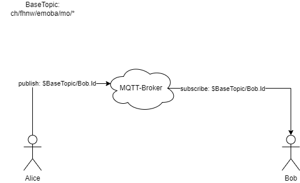

# FHNW-EMOBA-HS22-ThatsApp-Specification
Dataformat and Dataflow specification for Assignment 2 FHNW Emoba.

JSON Schema specification: https://json-schema.org/

## Base Topic
The Basic Topic for all Collaborators is `ch/fhnw/emoba/mo/*`

## Collaborator Profile
[Profile Schema](https://github.com/KZellweger/FHNW-EMOBA-HS22-ThatsApp-Specification/blob/main/profile.schema.json)

## Messages
[Message-Schema](https://github.com/KZellweger/FHNW-EMOBA-HS22-ThatsApp-Specification/blob/main/message.schema.json)

## App Init and Chatroom Members
To announce oneself in the global Chatroom the App must be registered in a central Topic on the Broker.
Therefore, you must send an object according to [Profile Schema](https://github.com/KZellweger/FHNW-EMOBA-HS22-ThatsApp-Specification/profile.schema.json) to the Topic `$BaseTopic/members`.

On Connect:
- Set your Online State to true.
On Disconnect:
- Set you Online State to false. 

## Message Exchange

To send a Message to any Collaborator you can send a Message Object to them by publishing to their UUID. 
A Message may contain any combination of Text, Images and Geo-Locations as payload. 
An empty Message is as well possible but no behavior is specified (responsibility of the app).

