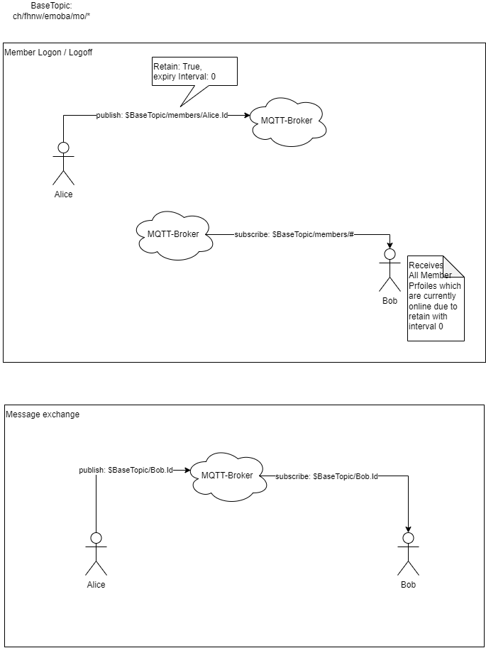

# FHNW-EMOBA-HS22-ThatsApp-Specification
Dataformat and Dataflow specification for Assignment 2 FHNW Emoba.

JSON Schema specification: https://json-schema.org/

## Base Topic
The Basic Topic for all Collaborators is `ch/fhnw/emoba/mo`

## App Init and Chatroom Members

That's App is a serverless Messaging App over Mqtt. A Collaborator does not possess any useful, static identification like a SIM-Card.

To enable a dynamic Profile Generation over multiple devices the following workflow must be implemented.

1. On Startup generate a random UUID (UUID.randomUUID())
2. Send your Profile according to [Profile Schema](https://github.com/KZellweger/FHNW-EMOBA-HS22-ThatsApp-Specification/profile.schema.json) to the Topic `$BaseTopic/members/<your UUID>` **Important:** onPuplish you must configure `retainFlag=true` and `messageExpiryInterval=0`
3. Subscribe to `$BaseTopic/members/#`
4. Filter your Own Profile out of the received Profiles.

The Configuration `retainFlag=true, messageExpiryInterval=0` tells the Broker to send your Profile to each Client when they Connect to the Broker as long as your Client is online. When you close your Client your Profile will no longer be propagated to the other Collaborators.

For further Details please Visit [https://www.hivemq.com/blog/mqtt5-essentials-part4-session-and-message-expiry](https://www.hivemq.com/blog/mqtt5-essentials-part4-session-and-message-expiry/#:~:text=Message%20Expiry%20Interval%20in%20MQTT%205,-A%20client%20can&text=When%20the%20retained%3Dtrue%20option,be%20retained%20for%20120%20seconds.)

### Optional Logoff
When you connect your Mqtt Client you may set your Last Will Message to set your Online State to false. So any Collaborator can display that state when you close your app. 
[https://www.hivemq.com/blog/mqtt-essentials-part-9-last-will-and-testament/](https://www.hivemq.com/blog/mqtt-essentials-part-9-last-will-and-testament/)

## Message Exchange

To send a Message to any Collaborator you can send a Message Object to them by publishing to their UUID. 
A Message may contain any combination of Text, Images and Geo-Locations as payload. 
An empty Message is as well possible but no behavior is specified (responsibility of the app).

### Message Format
[Message-Schema](https://github.com/KZellweger/FHNW-EMOBA-HS22-ThatsApp-Specification/blob/main/message.schema.json)

## Simple DataFlow Chart

